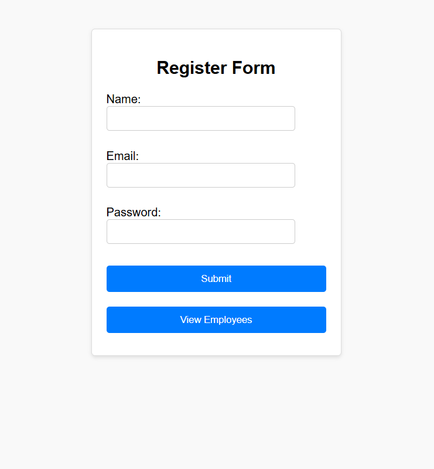
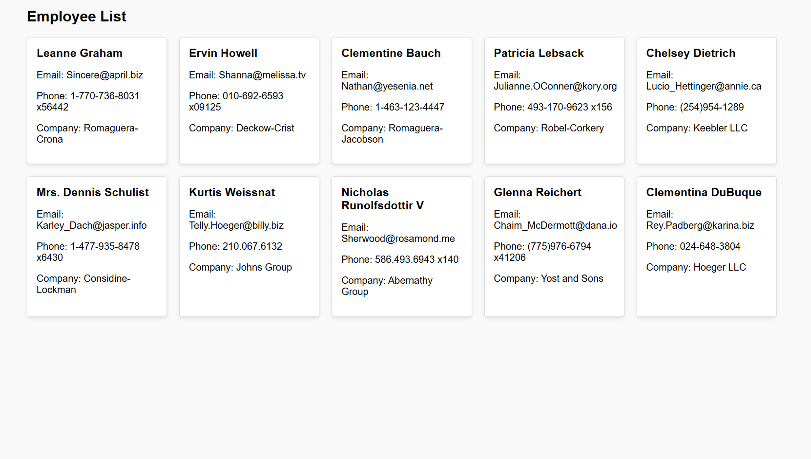

# abes2025

# Employee Management App

**Note**: Due to working on my college laptop, I was unable to upload the React app earlier as it was not functioning properly. I am now uploading the React app with the same code I provided in the test, but with added CSS for better styling.

## Project Overview




This project is a simple Employee Management app consisting of two main functionalities:

1. **Register Form**: A form where a user can input their name, email, and password.
2. **Employee List**: Displays a list of employees fetched from the JSONPlaceholder API.
3. **server**: A simple server using Node.js and Express.js to handle the registration form data and send it to the API.
---

## Features

- **Register Form**: A registration form to collect user data (name, email, password).
- **Employee List**: Fetches a list of employees from `https://jsonplaceholder.typicode.com/users` and displays their name, email, phone, and company details.
- **Routing**: Allows navigation between the registration form and employee list using React Router.

---

## Tech Stack

- **Frontend**: React
- **Backend**: Node (Data is fetched from the free JSONPlaceholder API)
- **Styling**: CSS (Custom CSS used for form and list styling)
- **API**: JSONPlaceholder (https://jsonplaceholder.typicode.com)

---

## How to Run the Project

1. **Clone the repository**:

```bash
git clone https://github.com/your-username/employee-management-app.git
cd employee-management-app

```
2. **Install dependencies**:
```bash
npm install
```
3. **Start the app**:
```bash
npm start
```
---
## File Structure
<!---BETTER_FILES_TREE-->
```
```
---
## How it Works
**Register Form**: On submitting the form, the input data (name, email, password) is sent to the https://jsonplaceholder.typicode.com/posts API.
**Employee List**: Displays a grid of employee data fetched from https://jsonplaceholder.typicode.com/users.

---
## Known Issues
The React app may not work properly on certain machines due to dependencies or network configurations. Please ensure that all dependencies are correctly installed before running the app.

---
## Future Improvements
**Backend Integration**: This app currently uses a mock API (JSONPlaceholder). Future improvements could include integrating with a real backend for authentication and CRUD operations.
**Form Validation**: Implement advanced form validation for better user experience.
**Styling**: Further improve the design using frameworks like Bootstrap or Material UI.